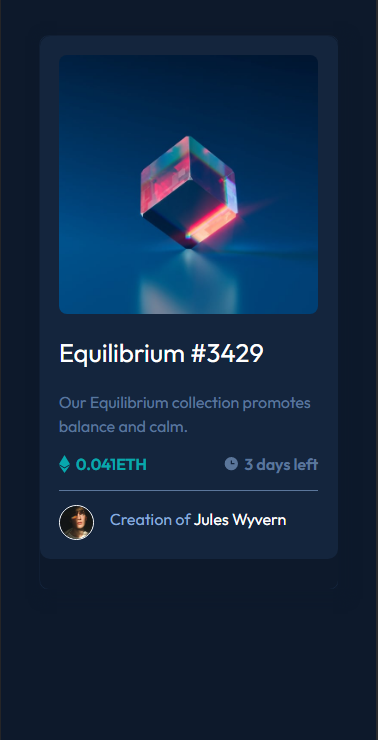
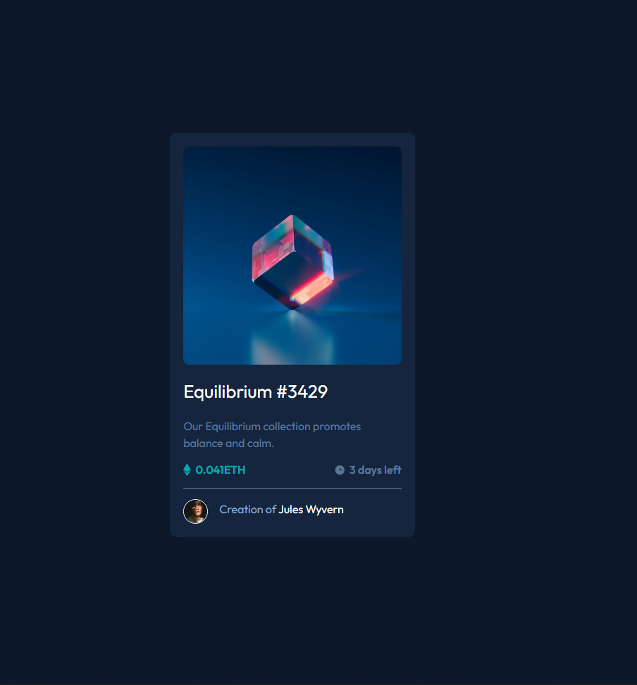

# Frontend Mentor - NFT preview card component solution

This is a solution to the [NFT preview card component challenge on Frontend Mentor](https://www.frontendmentor.io/challenges/nft-preview-card-component-SbdUL_w0U). Frontend Mentor challenges help you improve your coding skills by building realistic projects. 
## Overview

### Screenshot

**Mobile

**Desktop

### Links

- Solution URL: [Add solution URL here](https://your-solution-url.com)
- Live Site Solution URL: [Add live site URL here](https://your-live-site-url.com)
### Built with

- Semantic HTML5 markup
- CSS custom properties
- Flexbox
## Author

- Linkedin - https://www.linkedin.com/in/wallaceanterio/
- Frontend Mentor - [@yourusername](https://www.frontendmentor.io/profile/yourusername)
